# Base de données

PostgreSQL. Schéma géré par **Flyway** (`backend/src/main/resources/db/migration`,
`V1` → `V11`). `spring.jpa.hibernate.ddl-auto=validate` : Hibernate ne modifie
jamais le schéma, il vérifie seulement qu'il correspond aux entités.

Convention commune (classe `BaseEntity`) sur presque toutes les tables :
`id uuid` (PK), `version bigint` (verrou optimiste), `created_at` /
`updated_at timestamptz` (audit JPA). Les tables de jointure pures
(`user_roles`, `role_permissions`, `event_ticket_activities`) n'ont que leurs
deux clés étrangères.

---

## Comment visualiser le schéma

### 1. En ligne de commande (aucune installation)

```bash
docker exec -it plateforme-postgres psql -U plateforme -d plateforme

\dt                     -- liste des tables
\d+ events              -- colonnes, types, index, clés étrangères d'une table
\d+ payments
\x                      -- affichage vertical (lignes larges)
```

Lister toutes les clés étrangères d'un coup :

```sql
SELECT tc.table_name AS source, kcu.column_name AS colonne,
       ccu.table_name AS cible
FROM information_schema.table_constraints tc
JOIN information_schema.key_column_usage kcu
  ON tc.constraint_name = kcu.constraint_name
JOIN information_schema.constraint_column_usage ccu
  ON ccu.constraint_name = tc.constraint_name
WHERE tc.constraint_type = 'FOREIGN KEY'
ORDER BY 1, 2;
```

### 2. Interface graphique avec vue « diagramme »

Connexion : `localhost` · port `5433` · base `plateforme` · user `plateforme` · mot de passe `plateforme`.

| Outil | Vue ERD |
|---|---|
| **DBeaver** (gratuit) | clic droit sur la base → *View Diagram* — génère le diagramme entités/relations complet, exportable en PNG/SVG |
| **pgAdmin 4** | outil *ERD Tool* (menu de la base) — peut aussi faire l'inverse (dessiner → SQL) |
| **DataGrip / IntelliJ** | clic droit sur `public` → *Diagrams → Show Visualization* (Ctrl+Alt+Shift+U) |
| **VS Code** | extension *PostgreSQL* (Chris Kolkman) ou *Database Client* |

### 3. Diagramme automatique dans le navigateur (SchemaSpy)

```bash
docker run --rm --network host \
  -v "$PWD/docs/schemaspy:/output" \
  schemaspy/schemaspy:latest \
  -t pgsql -host localhost -port 5433 -db plateforme \
  -u plateforme -p plateforme -s public
# puis ouvrir docs/schemaspy/index.html
```

### 4. Le diagramme Mermaid ci-dessous

Il est versionné avec le code et se rend directement dans GitHub / GitLab, dans
l'aperçu Markdown de VS Code (extension *Markdown Preview Mermaid Support*) et
dans IntelliJ.

---

## Diagramme entités–relations

```mermaid
erDiagram
    %% ---------- Auth / RBAC ----------
    users ||--o{ refresh_tokens : possede
    users ||--o{ user_roles : a
    roles ||--o{ user_roles : donne
    roles ||--o{ role_permissions : accorde
    permissions ||--o{ role_permissions : dans
    users ||--o{ audit_logs : "trace (ref. souple, sans FK)"

    %% ---------- Structures / organisateurs ----------
    structures ||--o{ structure_members : regroupe
    users ||--o{ structure_members : membre
    users ||--o{ structures : "possede / cree"
    users ||--o| organizers : est
    structures ||--o{ organizers : rattache

    %% ---------- Événements ----------
    organizers ||--o{ events : organise
    event_categories ||--o{ events : classe
    events ||--o{ event_activities : programme
    speakers ||--o{ event_activities : anime
    events ||--o{ speakers : presente
    events ||--o{ partners : soutenu_par
    events ||--o{ event_staff : controle_par
    users ||--o{ event_staff : agent

    %% ---------- Billetterie ----------
    events ||--o{ event_tickets : propose
    event_tickets ||--o{ event_ticket_activities : couvre
    event_activities ||--o{ event_ticket_activities : incluse
    events ||--o{ ticket_orders : recoit
    users ||--o{ ticket_orders : achete
    structures ||--o{ ticket_orders : "achete (structure)"
    ticket_orders ||--o{ ticket_order_lines : detaille
    event_tickets ||--o{ ticket_order_lines : ligne
    ticket_orders ||--o{ tickets : emet
    event_tickets ||--o{ tickets : categorie
    events ||--o{ tickets : "billet de"

    %% ---------- Stands ----------
    events ||--o{ stand_types : definit
    stand_types ||--o{ stands : instancie
    events ||--o{ stands : "stand de"
    events ||--o{ stand_reservations : recoit
    stands ||--o| stand_reservations : "reserve (index unique partiel)"
    stand_types ||--o{ stand_reservations : type
    structures ||--o{ stand_reservations : "reserve (structure)"
    users ||--o{ stand_reservations : "reserve (contact)"

    %% ---------- Inscriptions ----------
    events ||--o{ registrations : recoit
    users ||--o{ registrations : "inscrit (particulier)"
    structures ||--o{ registrations : "inscrit (structure)"
    ticket_orders ||--o| registrations : "billets lies"
    registrations ||--o{ participants : liste

    %% ---------- Paiements / facturation ----------
    users ||--o{ payments : paie
    events ||--o{ payments : "paiement de"
    ticket_orders ||--o| payments : "cible commande"
    stand_reservations ||--o| payments : "cible reservation"
    registrations ||--o| payments : "cible inscription"
    payments ||--o{ invoices : "facture / recu"
    users ||--o{ invoices : destinataire
    events ||--o{ invoices : rattachee

    %% ---------- QR / contrôle d'accès ----------
    tickets ||--|| qr_codes : "jeton unique"
    qr_codes ||--o{ checkins : scanne
    tickets ||--o{ checkins : "controle de"
    events ||--o{ checkins : "a l'entree de"
    users ||--o{ checkins : "scanne par"

    %% ---------- Transverse ----------
    users ||--o{ notifications : recoit
    %% documents : lien polymorphe (owner_type + owner_id), sans FK

    users {
      uuid id PK
      string email UK
      string password_hash
      string first_name
      string last_name
      string phone
      string type "PARTICULIER|STRUCTURE|ORGANISATEUR|PERSONNEL|ADMIN"
      string status "ACTIF|EN_ATTENTE|DESACTIVE"
      timestamptz last_login_at
    }
    roles {
      uuid id PK
      string name UK
      boolean system_role
    }
    permissions {
      uuid id PK
      string name UK
    }
    refresh_tokens {
      uuid id PK
      uuid user_id FK
      string token_hash UK "SHA-256"
      timestamptz expires_at
      boolean revoked
    }
    audit_logs {
      uuid id PK
      uuid actor_id "ref souple, sans FK"
      string action
      string entity_type
      string entity_id
      string ip_address
      text details
    }
    structures {
      uuid id PK
      string raison_sociale
      string type_structure
      string rccm
      string ifu
      string ville
      string statut
      uuid owner_user_id FK
      uuid created_by FK
    }
    structure_members {
      uuid id PK
      uuid structure_id FK
      uuid user_id FK
      string role_interne
      boolean active
    }
    organizers {
      uuid id PK
      uuid user_id FK
      uuid structure_id FK "nullable"
      string nom_affichage
      string statut
      uuid approuve_par FK
    }
    event_categories {
      uuid id PK
      string nom UK
      string slug UK
      boolean actif
      int ordre
    }
    events {
      uuid id PK
      uuid organizer_id FK
      uuid category_id FK
      string nom
      string slug UK
      timestamptz date_debut
      timestamptz date_fin
      string ville
      boolean has_activities
      boolean stands_actifs
      boolean validation_inscription
      timestamptz inscription_debut
      timestamptz inscription_fin
      string statut "BROUILLON..TERMINE"
      timestamptz soumis_le
      timestamptz valide_le
      uuid valide_par
      timestamptz publie_le
    }
    event_activities {
      uuid id PK
      uuid event_id FK
      string titre
      string type_activite
      timestamptz date_debut
      timestamptz date_fin
      string salle
      uuid speaker_id FK "nullable"
      int capacite
      int ordre
    }
    speakers {
      uuid id PK
      uuid event_id FK
      string nom
      string titre
      string organisation
      int ordre
    }
    partners {
      uuid id PK
      uuid event_id FK
      string nom
      string niveau
      int ordre
    }
    event_staff {
      uuid id PK
      uuid event_id FK
      uuid user_id FK
      uuid ajoute_par FK
    }
    event_tickets {
      uuid id PK
      uuid event_id FK
      string nom
      numeric prix_montant
      string devise
      string portee "EVENEMENT|ACTIVITE"
      int quantite_totale
      int quantite_vendue
      int quantite_reservee
      int limite_par_utilisateur
      timestamptz vente_debut
      timestamptz vente_fin
      boolean actif
    }
    event_ticket_activities {
      uuid event_ticket_id FK
      uuid activity_id FK
    }
    ticket_orders {
      uuid id PK
      string reference UK
      uuid event_id FK
      uuid user_id FK
      uuid structure_id FK "nullable"
      numeric montant_total
      string statut "EN_ATTENTE|PAYEE|ANNULEE|EXPIREE"
      timestamptz expire_le
      timestamptz paye_le
    }
    ticket_order_lines {
      uuid id PK
      uuid order_id FK
      uuid event_ticket_id FK
      int quantite
      numeric prix_unitaire
    }
    tickets {
      uuid id PK
      uuid order_id FK
      uuid event_ticket_id FK
      uuid event_id FK
      string numero UK
      string participant_nom
      string statut "EMISE|UTILISE|ANNULE"
    }
    stand_types {
      uuid id PK
      uuid event_id FK
      string nom
      string dimensions
      numeric prix_montant
      int quantite_totale
      int ordre
    }
    stands {
      uuid id PK
      uuid stand_type_id FK
      uuid event_id FK
      string numero
      double position_x
      double position_y
      string statut "DISPONIBLE|RESERVE|INDISPONIBLE"
    }
    stand_reservations {
      uuid id PK
      string reference UK
      string numero_reservation UK
      uuid event_id FK
      uuid stand_id FK
      uuid stand_type_id FK
      uuid structure_id FK "nullable"
      uuid user_id FK
      numeric montant
      string statut "EN_ATTENTE..EXPIRE"
      timestamptz hold_expire_le
      timestamptz date_limite_paiement
      timestamptz paye_le
    }
    registrations {
      uuid id PK
      string reference UK
      uuid event_id FK
      uuid user_id FK "nullable"
      uuid structure_id FK "nullable"
      uuid ticket_order_id FK "nullable"
      string type "PARTICULIER|STRUCTURE"
      string statut "EN_ATTENTE|CONFIRMEE|ANNULEE|REFUSEE"
      int nombre_participants
      timestamptz confirmee_le
    }
    participants {
      uuid id PK
      uuid registration_id FK
      string nom
      string prenom
      string email
      string fonction
    }
    payments {
      uuid id PK
      string reference UK
      string transaction_ref "UK partiel (provider, transaction_ref)"
      string provider
      string moyen
      string target_type "TICKET_ORDER|STAND_RESERVATION"
      uuid target_id
      uuid ticket_order_id FK
      uuid stand_reservation_id FK
      uuid registration_id FK
      uuid user_id FK
      uuid event_id FK
      numeric montant
      string statut "EN_ATTENTE|REUSSI|ECHOUE|ANNULE|REMBOURSE"
      timestamptz paid_at
    }
    invoices {
      uuid id PK
      string numero UK
      string type "FACTURE|RECU"
      uuid payment_id FK
      uuid user_id FK
      uuid event_id FK
      numeric montant
      timestamptz emise_le
    }
    qr_codes {
      uuid id PK
      uuid ticket_id FK "UK"
      string token UK "jeton opaque"
      string statut "ACTIVE|REVOQUE"
    }
    checkins {
      uuid id PK
      uuid qr_code_id FK
      uuid ticket_id FK
      uuid event_id FK
      uuid scanned_by FK
      string resultat "VALIDE|DEJA_UTILISE|INVALIDE"
      timestamptz scanned_at
      string detail
    }
    notifications {
      uuid id PK
      uuid user_id FK
      string type
      string canal "IN_APP|EMAIL|SMS|WHATSAPP"
      string titre
      string contenu
      boolean lu
      timestamptz envoye_le
    }
    documents {
      uuid id PK
      string owner_type "REGISTRATION|..."
      uuid owner_id
      string nom
      string url
      string mime
      bigint taille
    }
```



---

## Tables par domaine

| Domaine | Tables |
|---|---|
| **Auth / RBAC / audit** (V1) | `users`, `roles`, `permissions`, `user_roles`, `role_permissions`, `refresh_tokens`, `audit_logs` |
| **Structures & organisateurs** (V2) | `structures`, `structure_members`, `organizers` |
| **Événements** (V3) | `event_categories`, `events`, `event_activities`, `speakers`, `partners` |
| **Billetterie** (V4) | `event_tickets`, `event_ticket_activities`, `ticket_orders`, `ticket_order_lines`, `tickets` |
| **Stands** (V5) | `stand_types`, `stands`, `stand_reservations` |
| **Inscriptions** (V6) | `registrations`, `participants`, `documents` |
| **Paiements** (V7) | `payments` |
| **QR codes** (V8) | `qr_codes` |
| **Contrôle d'accès** (V9) | `checkins`, `event_staff` |
| **Factures & reçus** (V10) | `invoices` |
| **Notifications** (V11) | `notifications` |

## Points de conception

- **Portée des billets** : `event_tickets.portee` ∈ {`EVENEMENT`, `ACTIVITE`}.
  Un billet lié à des activités est rattaché via la table N–N
  `event_ticket_activities`.
- **Quotas** : `event_tickets.quantite_vendue` / `quantite_reservee` et
  `stand_types` sont recalculés sous **verrou pessimiste**
  (`SELECT … FOR UPDATE`) à chaque commande / réservation / paiement / annulation.
- **Anti-double réservation de stand** : index **unique partiel** sur
  `stand_reservations(stand_id)` limité aux statuts actifs
  (`RESERVE_TEMP`, `ATTENTE_PAIEMENT`, `PAYE`, `CONFIRME`).
- **Idempotence des webhooks de paiement** : index unique partiel sur
  `payments(provider, transaction_ref)`.
- **`payments`** porte à la fois un lien polymorphe (`target_type` + `target_id`)
  et des FK typées nullables (`ticket_order_id`, `stand_reservation_id`,
  `registration_id`) pour les jointures.
- **`audit_logs.actor_id`** n'a **pas** de clé étrangère : les traces doivent
  survivre à la suppression d'un compte.
- **`documents`** utilise un lien polymorphe `owner_type` + `owner_id`
  (pas de FK) — aujourd'hui `owner_type = REGISTRATION`.
- Rien n'est considéré payé tant que `payments.statut` ≠ `REUSSI` ; la commande /
  réservation / inscription bascule alors seulement.
